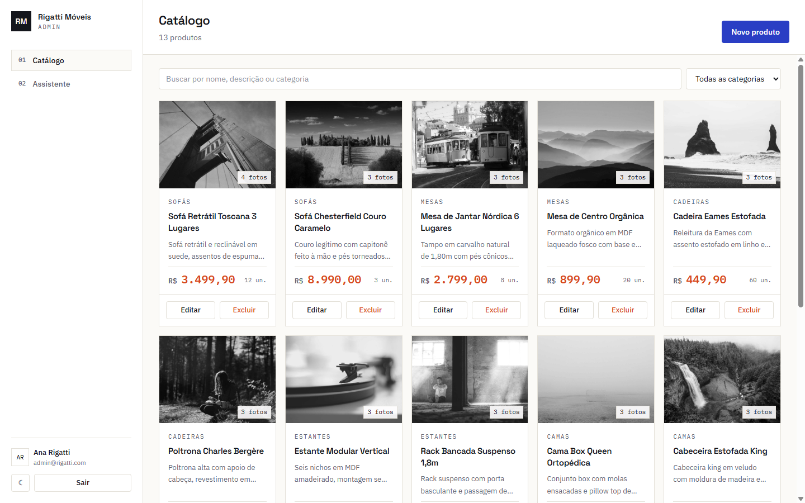
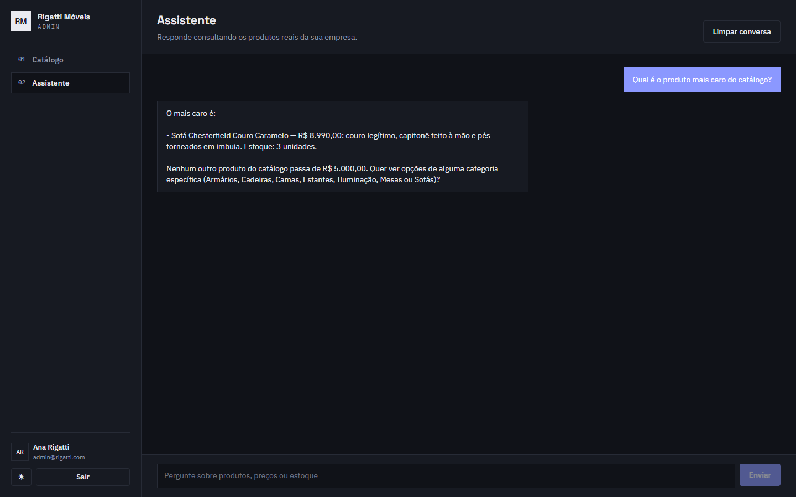
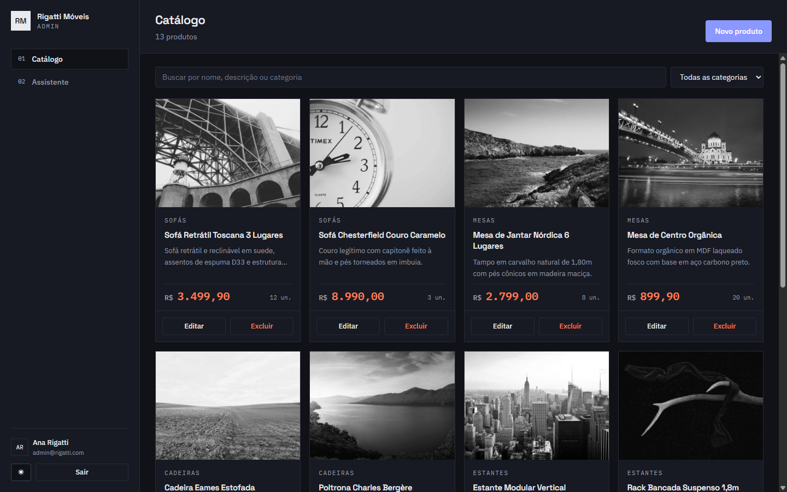

# Catálogo multi-tenant com agente de IA

Mini SaaS onde cada empresa gerencia o próprio catálogo de produtos e um agente de IA responde
perguntas dos clientes **consultando o banco de dados via tool calling** — sem inventar produto,
preço ou estoque, e sem nunca enxergar dados de outra empresa.

Backend em Node + Express + MongoDB (TypeScript), frontend em React + TypeScript.



---

## Índice

- [Rodando em 5 minutos](#rodando-em-5-minutos)
- [Decisões arquiteturais](#decisões-arquiteturais)
  - [Isolamento multi-tenant](#1-isolamento-multi-tenant-o-filtro-não-é-responsabilidade-de-quem-escreve-a-query)
  - [Autenticação e permissões](#2-autenticação-e-permissões)
  - [O agente de IA](#3-o-agente-de-ia)
  - [Estrutura do backend](#4-estrutura-do-backend)
  - [Estrutura do frontend](#5-estrutura-do-frontend)
  - [Design](#6-design)
- [Testes](#testes)
- [API](#api)
- [O que eu faria diferente em produção](#o-que-eu-faria-diferente-em-produção)
- [Escopo: o que ficou de fora e por quê](#escopo-o-que-ficou-de-fora-e-por-quê)

---

## Rodando em 5 minutos

**Pré-requisitos:** Node 20+ e uma chave da Anthropic. O MongoDB é opcional — o projeto sobe um
descartável se você não tiver nenhum.

```bash
git clone <este-repositório>
cd desafio_rigatti
```

**1. Backend**

```bash
cd server
npm install
cp .env.example .env      # edite: ANTHROPIC_API_KEY e JWT_SECRET
```

O `.env.example` já vem apontando para `mongodb://127.0.0.1:27017/catalogo`. Escolha uma das opções:

| Você tem | O que fazer |
| --- | --- |
| Nada instalado | `npm run db` em outro terminal (sobe um MongoDB efêmero na 27017) |
| Docker | `docker compose up -d mongo` na raiz |
| MongoDB Atlas | troque `MONGO_URI` no `.env` pela sua connection string |

```bash
npm run seed              # 2 empresas, 13 produtos cada, 2 usuários cada
npm run dev               # http://localhost:4000
```

**2. Frontend** (outro terminal)

```bash
cd web
npm install
npm run dev               # http://localhost:5173
```

**Contas criadas pelo seed** — senha `senha1234` em todas:

| Empresa | Admin | Usuário comum |
| --- | --- | --- |
| Rigatti Móveis | `admin@rigatti.com` | `user@rigatti.com` |
| TechNova Eletrônicos | `admin@technova.com` | `user@technova.com` |

> Para ver o multi-tenant funcionando, abra duas janelas anônimas e entre com uma conta de cada
> empresa. Os catálogos são completamente distintos, e o agente de cada uma só enxerga o seu.

**Docker Compose** (alternativa ao passo 1): crie um `.env` na raiz com `JWT_SECRET` e
`ANTHROPIC_API_KEY` e rode `docker compose up --build`. O seed continua sendo
`npm run seed` dentro de `server/`.

---

## Decisões arquiteturais

### 1. Isolamento multi-tenant: o filtro não é responsabilidade de quem escreve a query

Este é o ponto de maior risco do sistema. A abordagem comum — passar `{ companyId }` em cada
chamada ao banco — funciona até alguém esquecer uma linha, e o custo de esquecer é vazar dados
entre clientes. É uma dívida que cresce a cada endpoint novo.

Optei por mover a garantia para a **camada de dados**, em duas peças:

**`AsyncLocalStorage` carrega o tenant pelo request** ([`src/tenant/context.ts`](server/src/tenant/context.ts)).
O middleware de autenticação é o único ponto do sistema que decide de qual empresa é o request, e
abre o contexto para toda a cadeia seguinte:

```ts
// src/middleware/authenticate.ts
const claims = verifyToken(token);
req.auth = claims;
runInTenant(claims.companyId, next);
```

**Um plugin do Mongoose injeta o filtro e falha na ausência de contexto**
([`src/tenant/plugin.ts`](server/src/tenant/plugin.ts)):

```ts
schema.pre(GUARDED_QUERIES, function () {
  this.where({ companyId: new Types.ObjectId(requireTenant()) });
});

schema.pre('validate', function () {
  if (this.isNew) this.companyId = new Types.ObjectId(requireTenant());
});
```

Três consequências que valem a complexidade:

1. **O default virou seguro.** `Product.find({ category })` já é uma query isolada. Não existe a
   variante insegura para alguém escrever por engano.
2. **Esquecer o contexto é erro alto, não vazamento silencioso.** `requireTenant()` lança se não
   houver tenant — a query morre em vez de retornar o banco inteiro.
3. **O contexto é a autoridade na escrita.** O `pre('validate')` *sobrescreve* o `companyId`, não
   preenche só quando ausente. Um payload malicioso com `companyId` de outra empresa é ignorado.

   Essa última linha nasceu de um teste que falhou: a primeira versão usava `if (this.isNew && !this.companyId)`,
   e o teste `escreve o produto no tenant do contexto, ignorando companyId forjado` pegou a brecha.
   O schema Zod já barraria o campo na borda HTTP, mas defesa em profundidade é justamente não
   depender de uma camada só.

**Onde o plugin não se aplica, e por quê.** `User` é a única coleção com `companyId` que não usa o
plugin: o login roda *antes* de existir tenant — é ele quem resolve qual é o tenant. `Company` é o
próprio escopo. `Image` fica de fora porque o `GET` é público (ver [imagens](#upload-de-imagens)).

**Índices.** Todo índice começa por `companyId` (`{ companyId, category, price }`,
`{ companyId, createdAt }`), que é o formato certo quando o filtro de tenant está sempre presente.

**Escape hatch explícito.** O seed precisa cruzar empresas legitimamente, então existe
`runAsSystem()`. Ele vive no módulo de contexto e não é alcançável por nenhuma rota HTTP.

### 2. Autenticação e permissões

- **JWT stateless** com claims `{ sub, companyId, role, name, email }`, expiração de 8h e `issuer`
  verificado. O `companyId` estar dentro do token é o que permite o middleware abrir o contexto de
  tenant sem uma ida ao banco por request.
- **Senhas com bcrypt** (12 rounds). O login compara contra um hash inválido mesmo quando o e-mail
  não existe, para não vazar por *timing* quais e-mails estão cadastrados.
- **Registro cria empresa + admin.** O primeiro usuário é o dono do tenant; ele cria os demais via
  `POST /api/auth/users`.
- **`requireRole('admin')`** protege escrita de produtos. `user` lê o catálogo e usa o chat.
- **`GET /me` relê do banco.** O JWT sozinho não basta: um usuário removido continuaria com sessão
  válida até o token expirar. Isso apareceu na prática ao rodar o seed de novo com uma sessão
  aberta — a UI seguia "logada" numa empresa que não existia mais.
- **Rate limit** em `/auth` (20 req / 15 min por IP) e `/chat` (20 msg / min por usuário).

**Token no `localStorage`, e por quê.** Cookie `httpOnly` é mais resistente a XSS e seria a escolha
para um domínio único. Aqui o frontend e a API vivem em origens diferentes, o que exigiria
`SameSite=None; Secure` mais tratamento de CSRF — complexidade que só se paga com a mitigação de
XSS correspondente (CSP, sanitização), fora do escopo. Assumi a troca conscientemente; em produção
a decisão muda (ver [produção](#o-que-eu-faria-diferente-em-produção)).

### 3. O agente de IA

`POST /api/chat` roda um **loop de tool calling real** contra a Messages API da Anthropic
([`src/modules/chat/agent.ts`](server/src/modules/chat/agent.ts)) — não é um wrapper que passa a
pergunta adiante.

```
mensagem do usuário
      ↓
  Claude decide
      ↓
  tool_use ──► search_products / list_categories ──► MongoDB (filtrado por tenant)
      ↓                                                    │
      └────────────── tool_result ◄────────────────────────┘
      ↓
  (repete até stop_reason ≠ 'tool_use', no máximo 5 rodadas)
      ↓
  resposta em streaming
```

**Duas ferramentas**, definidas em [`agent.tools.ts`](server/src/modules/chat/agent.tools.ts):

| Ferramenta | Para quê |
| --- | --- |
| `search_products` | Busca por termo, categoria e faixa de preço |
| `list_categories` | Deixa o modelo descobrir as categorias antes de filtrar |

Cada ferramenta declara o schema para o modelo **e** valida a entrada com Zod antes de tocar o
banco — o modelo é uma fonte não confiável como qualquer outra.

**O isolamento vale para o agente também.** As ferramentas chamam o mesmo `product.service` das
rotas HTTP, então herdam o plugin de tenant. Além disso, o agente captura o tenant na criação e o
reabre explicitamente na execução, porque a ferramenta roda fora da stack do request:

```ts
const result = await runInTenant(tenant, () => runTool(block.name, block.input));
```

Há um teste cobrindo exatamente isso: buscar "Alpha" pela ferramenta, logado no tenant Beta, retorna
zero resultados.

**Streaming via SSE.** O endpoint devolve `text/event-stream` com três tipos de evento: `text`
(delta de texto), `tool` (ferramenta em uso) e `done`. O evento `tool` é o que permite a UI mostrar
*qual consulta o agente fez* — a prova visível de que a resposta veio do banco.



Se o cliente fecha a aba no meio da resposta, um `AbortController` cancela a chamada ao modelo em
vez de seguir gerando tokens que ninguém vai ler.

Uso `fetch` + `ReadableStream` no cliente em vez de `EventSource` porque `EventSource` não envia
header `Authorization`.

**System prompt** com regras explícitas: responder só com o que as ferramentas retornarem, admitir
quando não encontrar, formatar em reais, e explicar que não tem acesso a outras empresas.

**Modelo:** `claude-opus-5`, configurável por `ANTHROPIC_MODEL`. Rodo com `effort: 'low'`, que para
consultas de catálogo entrega a mesma qualidade com bem menos latência e custo.

**Histórico** persistido por usuário (`Message`, também tenant-scoped), limitado às últimas 30
mensagens enviadas ao modelo — mantém o contexto útil sem crescer o custo indefinidamente.

### 4. Estrutura do backend

Organizado **por módulo de domínio**, não por tipo de arquivo. Um módulo carrega seu model, schema
de validação, service e rotas juntos; abrir a pasta `products/` mostra tudo sobre produtos.

```
server/src/
├── config/env.ts          Env validado com Zod no boot — falta variável, processo morre
├── tenant/                context.ts (AsyncLocalStorage) + plugin.ts (Mongoose)
├── middleware/            authenticate.ts (JWT + tenant + roles), error-handler.ts
├── modules/
│   ├── auth/              user.model, auth.{schemas,service,routes,tokens}
│   ├── company/           company.model
│   ├── products/          product.{model,schemas,service,routes}
│   ├── images/            image.{model,routes}
│   └── chat/              message.model, agent.ts, agent.tools.ts, chat.routes.ts
├── db/connect.ts
├── app.ts                 Monta o Express (usado também pelos testes)
└── server.ts              Conecta o banco, sobe, trata SIGTERM
```

**Camadas:** rota valida entrada (Zod) e devolve HTTP; service tem a regra de negócio e não conhece
`req`/`res`; model define schema e índices. A validação fica na rota porque é ali que entra dado
não confiável.

**Tratamento de erro centralizado.** Express 5 encaminha rejeições de handlers `async`
automaticamente, o que dispensa qualquer `asyncHandler` wrapper. Um único
[`error-handler`](server/src/middleware/error-handler.ts) traduz `ZodError` → 422 com a lista de
campos, `AppError` → status próprio, duplicidade do Mongo → 409, e qualquer outra coisa → 500
genérico. **Erro não previsto nunca vaza detalhe interno** — é a razão de existir a classe
`AppError`: só o que é explicitamente de aplicação chega ao cliente.

**Escrita e leitura nunca expõem `companyId`.** O `toJSON` do plugin remove o campo e troca `_id`
por `id`.

#### Upload de imagens

`POST /api/images` recebe via Multer em memória (limite de 2 MB, apenas JPEG/PNG/WebP/AVIF) e grava
o binário no Mongo; `GET /api/images/:id` serve com `Cache-Control` imutável. Guardar imagem no
banco não é o que eu faria em produção — é o que evita depender de disco (que serverless não tem)
ou de uma conta S3/Cloudinary para o avaliador rodar o projeto. O `GET` é **público**: ``
não carrega header `Authorization`. Em produção seria S3 + CloudFront com URL assinada.

### 5. Estrutura do frontend

```
web/src/
├── api/            http.ts (fetch, token, erros) + um arquivo por domínio + types.ts
├── auth/           AuthContext.tsx, useAuth.ts
├── hooks/          useProductCatalog, useChatSession, useDebouncedValue, useTheme
├── components/
│   ├── ui/         Button, Field, Modal, Feedback  ← primitivos sem domínio
│   ├── layout/     AppShell, Sidebar, ThemeToggle
│   ├── auth/       AuthForm
│   ├── products/   ProductCard, ProductFilters, ProductFormModal, Pagination
│   └── chat/       ChatTranscript, ChatBubble, ChatComposer, ChatWelcome, ToolTrace
├── pages/          LoginPage, ProductsPage, ChatPage
└── lib/format.ts
```

**As páginas são finas.** Estado e efeitos moram em hooks (`useProductCatalog` cuida de filtros,
debounce, paginação e recarga; `useChatSession` cuida do stream e da montagem das bolhas), e a
página só compõe. `ProductsPage` inteira cabe numa tela.

**Separação por responsabilidade nos componentes:** `ui/` não conhece domínio e é reutilizável;
`products/` e `chat/` conhecem os tipos do negócio.

**Sem React Query.** Duas telas com um recurso cada não justificam a dependência — `useProductCatalog`
resolve em ~50 linhas legíveis. Com mais telas, entraria.

### 6. Design

Evitei o visual padrão de dashboard (cartões arredondados, sombras difusas, azul genérico) e parti
do vocabulário do próprio produto: **catálogo impresso e etiqueta de preço**.

- **O número é o herói.** Preços em monoespaçada tabular, com o `R$` reduzido e uma régua fina
  acima — a leitura de uma ficha de catálogo. Categorias como *eyebrow* em mono caixa-alta.
- **Réguas de 1px e raio de 4px** em vez de sombras e cantos arredondados.
- **Tipografia:** Space Grotesk (display), IBM Plex Sans (texto), IBM Plex Mono (números e códigos).
- **Paleta:** papel morno + tinta, azul-tinta `#2a3ec4` e laranja-etiqueta `#d8471c`. O laranja
  aparece **só** no preço e em ações destrutivas.
- **A assinatura é o rastro do agente:** cada tool call vira uma linha de razão no chat
  (`→ consultou o catálogo · search_products`). O produto todo se resume a "o agente lê o catálogo
  de verdade" — então isso é o que a interface mostra.

**Tailwind v4** com os tokens em `@theme`. O tema escuro troca o valor das variáveis CSS, então as
utilities acompanham sem `dark:` espalhado pela marcação.

Responsivo, foco visível no teclado, `aria-label` nos controles de ícone e `prefers-reduced-motion`
respeitado.

| Claro | Escuro |
| --- | --- |
|  |  |

---

## Testes

```bash
cd server && npm test     # 12 testes, MongoDB em memória
```

Cobrem o que dói se quebrar, não cobertura por cobertura:

**`tenant-isolation.test.ts`** — listar só o próprio tenant; não ler produto de outra empresa nem
sabendo o `id`; não atualizar nem apagar cruzando tenant; query sem contexto falhar; `companyId`
forjado no payload ser ignorado; **a ferramenta do agente respeitar o tenant**.

**`api.test.ts`** — registro cria admin; credencial inválida e request sem token → 401; `user`
recebe 403 ao criar produto e 200 ao listar; listagem e busca por id isoladas por token; `companyId`
não aparece na resposta; payload inválido → 422 com os campos.

---

## API

Todas as rotas sob `/api` exigem `Authorization: Bearer <token>`, exceto `register`, `login` e o
`GET` de imagem.

| Método | Rota | Quem pode |
| --- | --- | --- |
| `POST` | `/api/auth/register` | público — cria empresa + admin |
| `POST` | `/api/auth/login` | público |
| `GET` | `/api/auth/me` | autenticado |
| `POST` | `/api/auth/users` | admin |
| `GET` | `/api/products` | autenticado — `search`, `category`, `minPrice`, `maxPrice`, `page`, `limit` |
| `GET` | `/api/products/categories` | autenticado |
| `GET` | `/api/products/:id` | autenticado |
| `POST` `PATCH` `DELETE` | `/api/products[/:id]` | **admin** |
| `POST` | `/api/images` | **admin** — `multipart/form-data`, campo `file` |
| `GET` | `/api/images/:id` | público |
| `POST` | `/api/chat` | autenticado — responde `text/event-stream` |
| `GET` `DELETE` | `/api/chat/history` | autenticado |

---

## O que eu faria diferente em produção

**Segurança**

- **Access token curto (15 min) + refresh token em cookie `httpOnly`, `Secure`, `SameSite=Strict`**,
  com rotação e detecção de reuso. Resolve tanto o XSS do `localStorage` quanto a revogação: hoje
  um token roubado vale até expirar.
- **Segredos em cofre** (AWS Secrets Manager / Doppler), não em `.env` no servidor.
- **CSP e sanitização** no frontend, que é o que torna o cookie `httpOnly` uma defesa completa.
- **Verificação de e-mail e política de senha** (hoje o registro é imediato e a regra é só tamanho).
- **Auditoria** de escrita: quem mudou preço, quando, de quanto para quanto.

**Escala**

- **Índice de busca de verdade.** Hoje `search` usa regex case-insensitive, que não usa índice e
  degrada com o volume. Trocaria por Atlas Search / OpenSearch — que também melhora a qualidade das
  respostas do agente.
- **Paginação por cursor** no lugar de `skip`/`limit`, que fica caro em páginas altas.
- **Cache** de catálogo e categorias em Redis, invalidado na escrita. Categorias são um `distinct`
  em toda requisição da tela.
- **Imagens no S3 + CDN**, com upload direto por URL pré-assinada e derivadas (thumb/webp). Binário
  no Mongo não escala.
- **Prompt caching** da Anthropic no system prompt e nas definições de ferramenta, que são idênticos
  a cada request — corta custo e latência sem mudar comportamento.
- **Rate limit distribuído** (store Redis). O atual é por processo e some no restart.
- **Fila** para tarefas do agente que não precisam ser síncronas.

**Operação**

- **Logs estruturados** (Pino) com `requestId` e `companyId` correlacionados, sem PII.
- **OpenTelemetry** com atenção a p95 do `/chat`, taxa de tool call e tokens por conversa — custo de
  LLM é métrica de produto, não só de infra.
- **Erros no Sentry**; alertas de 5xx, saturação de pool do Mongo e falha da API da Anthropic.
- **Health check separando liveness de readiness** (o atual não verifica o Mongo).
- **CI** rodando lint, typecheck e testes; deploy com migrations versionadas.
- **Evals do agente**: um conjunto de perguntas com resposta esperada, rodando a cada mudança de
  prompt ou de modelo. Sem isso, mexer no prompt é mudar comportamento no escuro.

**Produto**

- Timeout e cancelamento no stream do chat (`AbortController` já preparado no cliente).
- Múltiplas conversas por usuário, em vez de uma linha do tempo só.
- Convite de usuário por e-mail com token, no lugar de o admin definir a senha.

---

## Escopo: o que ficou de fora e por quê

Segui o critério do enunciado — decisão justificada vale mais que quantidade de recurso.

- **Refresh token** — descrito acima; não cabia nas 6–8h junto do resto, e meia implementação de
  auth é pior que uma simples e consciente.
- **React Query / Redux** — duas telas não pagam a dependência.
- **Testes de frontend** — priorizei os testes de backend, onde mora o risco real (isolamento entre
  empresas e permissões). Um teste de UI quebrado não vaza dado de cliente.
- **Deploy publicado** — o enunciado dispensa. O projeto está pronto para isso: `Dockerfile`
  multi-stage, `docker-compose.yml`, `vercel.json` para SPA e API configurável por env. O backend
  precisa de processo longo (o SSE do chat não sobrevive bem a serverless), então iria para
  Render/Railway/Fly com o frontend na Vercel e o banco no Atlas.
- **Múltiplas empresas por usuário** — hoje o e-mail é único global e pertence a uma empresa. Com
  self-service real viraria índice composto `{ companyId, email }` e um seletor de workspace.
